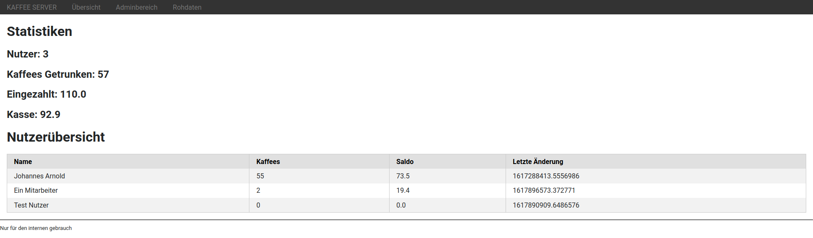
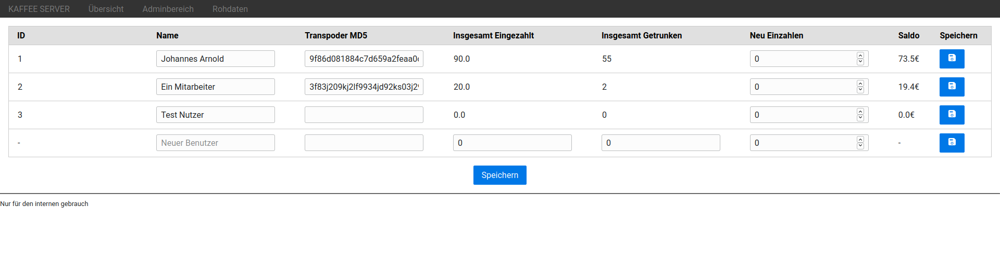

# kaffee-server

[](https://github.com/j0hax/kaffee-server/actions/workflows/python-app.yml)
[](https://lgtm.com/projects/g/j0hax/kaffee-server/context:python)


REST-Schnittstelle für das [Kaffeesystem](https://github.com/j0hax/kaffee-ui)

## Anwendungsbeispiel
```console
$ curl http://server:8080/api
[
   {
      "balance":1310,
      "depositCount":1,
      "deposits":2000,
      "hash":"3c39d55b2adac67d15a69e6f5f828c1a",
      "id":1,
      "lastUpdate":1620142207.0,
      "name":"Buxe",
      "withdrawalCount":23,
      "withdrawals":-690
   },
]
```

## Web-Oberfläche




Eine einfache Weboberfläche erlaubt für das Administrieren von Nutzerdaten.

## Datenbanken

### users
Die Users-Datenbank dient als Speicher für Nutzerdaten wie Name und Transponder Hash.

```console
$ sqlite3 -header -column coffee.db "SELECT rowid, * FROM users;"
rowid  name      last_update       transponder_hash
-----  --------  ----------------  --------------------------------
1      Buxe      1620142207.0      3c39d55b2adac67d15a69e6f5f828c1a
```

### transactions
Die Transactions-Datenbank dient als Aufzeichnung aller Zu- und Abbuchungen.

```console
$ sqlite3 -header -column coffee.db "SELECT * FROM transactions WHERE user = 1;
user  amount  description                    timestamp     
----  ------  -----------------------------  --------------
1     -30     Buchung vom Kaffeesysem        16201415012.45
1     2000    Einzahlung durch Adminbereich  1620142207.0  
1     -30     Buchung vom Kaffeesysem        16201422243.59
```

### balances
Ein View, welcher Transaktionen zusammenzählt und Nutzern zuordnet.

```console
$ sqlite3 -header -column coffee.db "SELECT * FROM balances;
user  deposit_count  deposits  withdrawal_count  withdrawals  balance
----  -------------  --------  ----------------  -----------  -------
1     1              2000      23                -690         1310 
```

### clients
Die Clients-Datenbank enthält aktuell nur erlaubte API-Keys.

```console
$ sqlite3 -header -column coffee.db "SELECT * FROM clients;"
api_key                         
--------------------------------
pClZQgSXmHgIt1sHeOpb64iHrLxfc+7D
```

Neue API-Schlüssel können wie folgend mit zufälligen Daten erzeugt werden. 

```console
$ cat /dev/random | base64 | head -c 32
```
